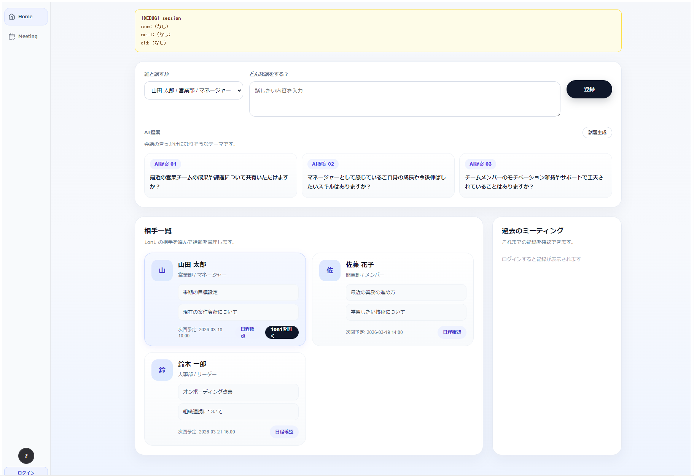
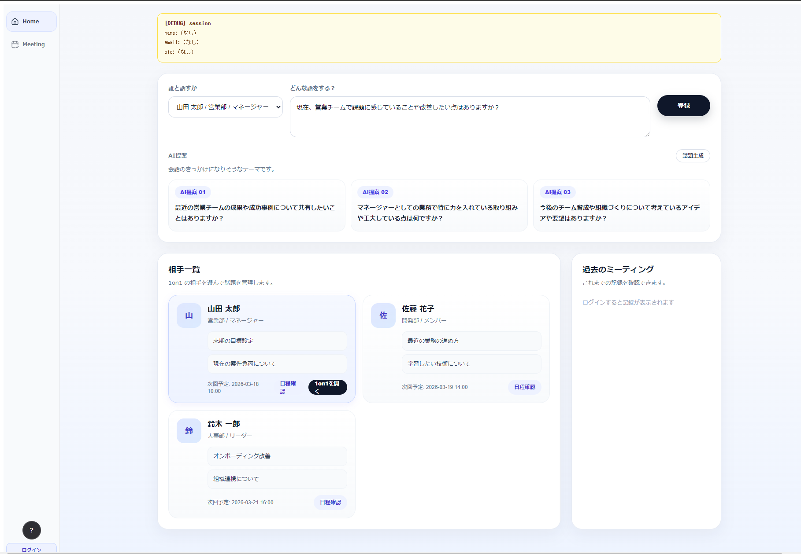
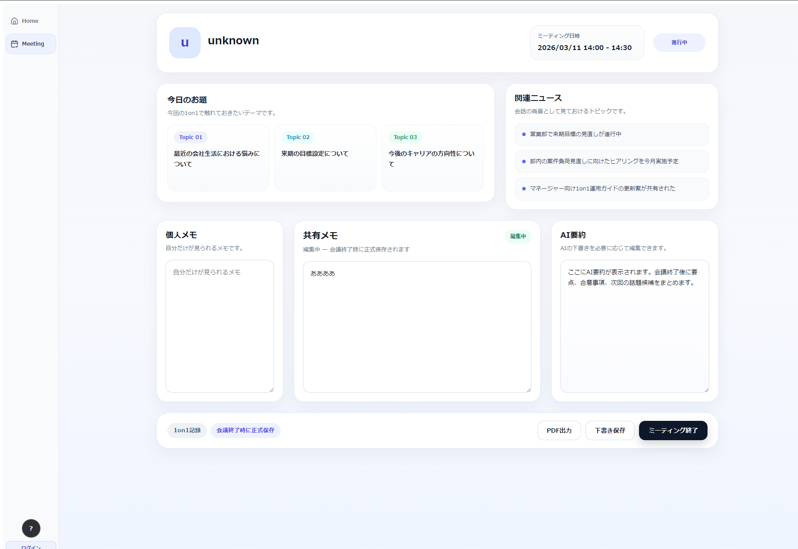

# TalkSeed UI

TalkSeed は、1on1 ミーティングを支援するための Web アプリケーションです。  
このリポジトリは、フロントエンド UI をまとめたものです。

1on1 の相手選択、会話テーマ入力、AI による話題提案、ミーティング中のメモ管理、要約確認までをブラウザ上で扱えるようにしています。

---

## Overview

TalkSeed UI では、1on1 実施前から実施中までの流れを一つの画面体験にまとめています。

- 誰と話すかを選ぶ
- 話したい内容を入力する
- AI が話題候補を提案する
- 1on1 中に個人メモ / 共有メモを残す
- AI 要約や PDF 出力につなげる

バックエンド API と連携し、実際の業務利用を想定した UI として構成しています。

---

## Tech Stack

- Next.js
- TypeScript
- NextAuth
- Microsoft Entra ID
- CSS Modules
- Azure App Service

---

## Main Features

### 1. Home Screen

- 1on1 の相手一覧を表示
- 相手ごとのトピックや次回予定を確認
- 過去のミーティング導線を用意

### 2. AI Topic Suggestions

- 会話テーマ入力をもとに、AI が話題候補を提案
- 1on1 前の準備を支援
- 入力内容に応じて複数候補を表示

### 3. Meeting Screen

- 個人メモ
- 共有メモ
- AI 要約表示
- ミーティング終了操作
- PDF 出力導線

### 4. API Integration

- FastAPI バックエンドと連携
- ミーティングデータ取得 / 保存
- AI 話題提案取得
- PDF 出力連携

---

## Screenshots

### Home

相手選択、会話テーマ入力、AI による話題提案をまとめたトップ画面。



### Home (AI Topic Suggestions)

入力内容に応じて、1on1 で使える話題候補を複数提示する状態。



### Meeting

個人メモ、共有メモ、AI 要約、PDF 出力をまとめたミーティング画面。



---

## Project Structure

```text
app/
├─ (home)/
├─ api/
│  ├─ auth/
│  └─ graph/
├─ meeting/
├─ layout.tsx
├─ providers.tsx
components/
├─ auth/
├─ layout/
└─ mvp/
lib/
types/
auth.ts
next.config.mjs
package.json


Local Development
1. Install dependencies
npm install
2. Start development server
npm run dev
3. Access
http://localhost:3000
Environment Variables

実行には認証や API 接続用の環境変数が必要です。
例:

AUTH_SECRET
AUTH_MICROSOFT_ENTRA_ID_ID
AUTH_MICROSOFT_ENTRA_ID_SECRET
AUTH_MICROSOFT_ENTRA_ID_ISSUER
NEXT_PUBLIC_API_BASE
NEXT_PUBLIC_APP_URL

秘密情報は .env / .env.local で管理し、GitHub には含めていません。

Notes

このリポジトリでは、公開用に以下を除外しています。

node_modules/
.next/
.env*
deploy 用 zip
build 生成物
ローカル用補助ファイル